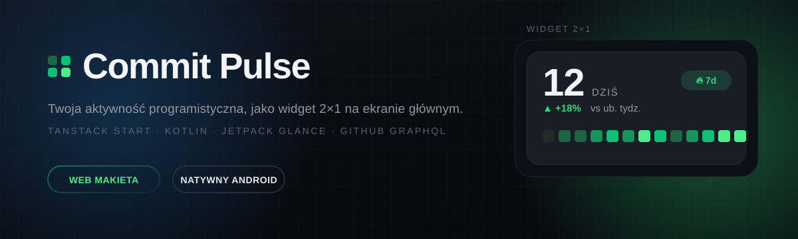
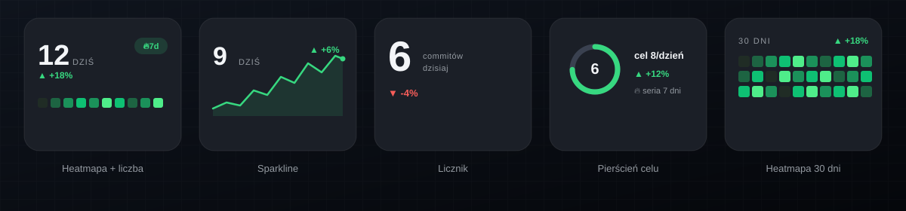
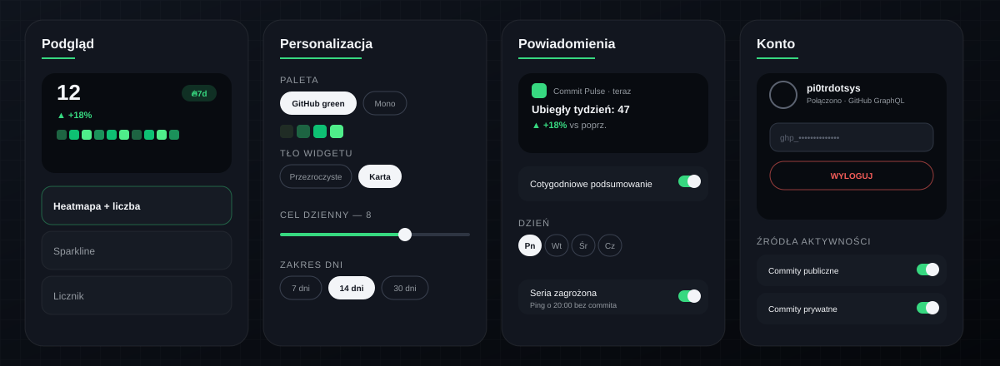
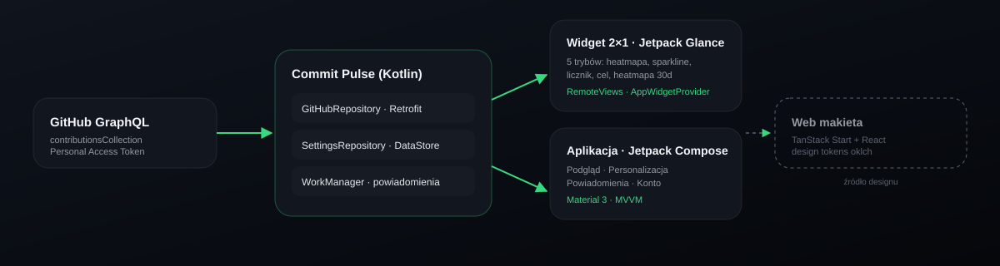

<div align="center">



<br/>

[](android)
[](android)
[](src)
[](android)

</div>

## O projekcie

**Commit Pulse** to widget 2×1 na ekran główny Androida, który pokazuje Twoją
codzienną aktywność programistyczną na GitHubie — dokładnie tak, jak
kontribution graph na GitHubie, ale zawsze na wyciągnięcie kciuka, bez
odpalania przeglądarki.

Repozytorium zawiera dwie realizacje tego samego pomysłu:

- **web makieta** (`src/`) — interaktywny prototyp w TanStack Start + React,
  służący do projektowania wyglądu widgetu i aplikacji konfiguracyjnej na
  fikcyjnych danych,
- **natywna aplikacja Android** (`android/`) — pełnoprawny port w Kotlinie:
  prawdziwy widget (Jetpack Glance) zasilany realnymi danymi z GitHub GraphQL
  API, plus aplikacja konfiguracyjna w Jetpack Compose.

Design zbudowany wokół jednego pytania: *jak zmieścić rytm swojej pracy w
2×1 kafelku, nie tracąc przy tym czytelności?* Stąd pięć trybów wizualizacji,
paleta kolorów oparta o oklch i typografia z naciskiem na duże, wyraziste
liczby.

## Zrzuty ekranu

#### Widget — 5 trybów wizualizacji



#### Aplikacja konfiguracyjna



> Zrzuty ekranu są wektorowymi (SVG) rekonstrukcjami rzeczywistego UI —
> zbudowanymi z tych samych tokenów kolorów co produkcyjny kod, żeby README
> renderowało się ostro na każdym ekranie i w każdym motywie.

## Architektura



## Funkcje

| | |
|---|---|
| 🔥 **Heatmapa + streak** | 14 dni aktywności, licznik dnia, seria z rogu w stylu GitHuba |
| 📈 **Sparkline** | Krzywa trendu ostatnich dni zamiast siatki kwadratów |
| 🔢 **Licznik** | Duża liczba + delta tydzień do tygodnia |
| 🎯 **Pierścień celu** | Wizualny postęp do dziennego celu commitów |
| 🗓️ **Heatmapa 30 dni** | Kompaktowy widok całego miesiąca rytmu pracy |
| 🎨 **3 palety kolorów** | GitHub green / Mono / Custom amber |
| 🔐 **Prawdziwe dane** | GitHub GraphQL (`contributionsCollection`), token szyfrowany w Android Keystore |
| 🔔 **Powiadomienia** | Cotygodniowe podsumowanie, alert zagrożonej serii, alert osiągniętego celu |
| ⏱️ **Auto-odświeżanie** | WorkManager w tle — co 15 min / 1 godz. / 6 godz. |

## Tech stack

**Android (`android/`)**
Kotlin · Jetpack Compose (Material 3) · Jetpack Glance (App Widgets) ·
DataStore · WorkManager · Retrofit + kotlinx.serialization · GitHub GraphQL API ·
androidx.security-crypto

**Web makieta (`src/`)**
TanStack Start · React · TypeScript · Tailwind CSS · shadcn/ui

## Uruchomienie

### Web makieta

```sh
npm install
npm run dev
```

### Aplikacja Android

```sh
cd android
./gradlew assembleDebug
```

APK trafia do `android/app/build/outputs/apk/debug/app-debug.apk`. Do
zalogowania w zakładce **Konto** potrzebny jest GitHub Personal Access Token
(classic) ze scope `read:user` — token jest szyfrowany lokalnie i nigdy nie
opuszcza urządzenia poza wywołaniami do `api.github.com`.

## Struktura repozytorium

```text
.
├── src/                  # web makieta (TanStack Start + React)
│   ├── components/widget/ # WidgetPreview, PhoneFrame, NotificationMock
│   └── lib/               # generator danych, tokeny ustawień
├── android/              # natywna aplikacja Kotlin
│   └── app/src/main/kotlin/com/commitpulse/app/
│       ├── widget/        # Glance AppWidget (5 trybów)
│       ├── github/        # klient GraphQL + bezpieczne przechowywanie tokenu
│       ├── settings/      # DataStore z ustawieniami widgetu
│       ├── work/          # WorkManager: odświeżanie i powiadomienia
│       └── ui/            # ekrany Compose (podgląd, personalizacja, powiadomienia, konto)
└── docs/assets/          # ilustracje SVG użyte w tym README
```

## Znane ograniczenia

- GitHub GraphQL zwraca łączną liczbę kontrybucji (commity + PR-y + review'y +
  issues) w rozbiciu dziennym — bez podziału per typ, stąd przełączniki
  „Pull requesty” / „Review'y” w zakładce Konto są na razie tylko wizualne.
- Logowanie działa przez Personal Access Token; przycisk OAuth z makiety nie
  jest podłączony (wymagałby własnego backendu do wymiany client secret).
- Ustawienia widgetu są globalne dla całej aplikacji — nie ma osobnej
  konfiguracji per instancja widgetu, zgodnie z pierwotną makietą.

---

<div align="center">
<sub>Zbudowane z myślą o tych, którzy wolą zerknąć na ekran główny niż otwierać kolejną kartę przeglądarki.</sub>
</div>
